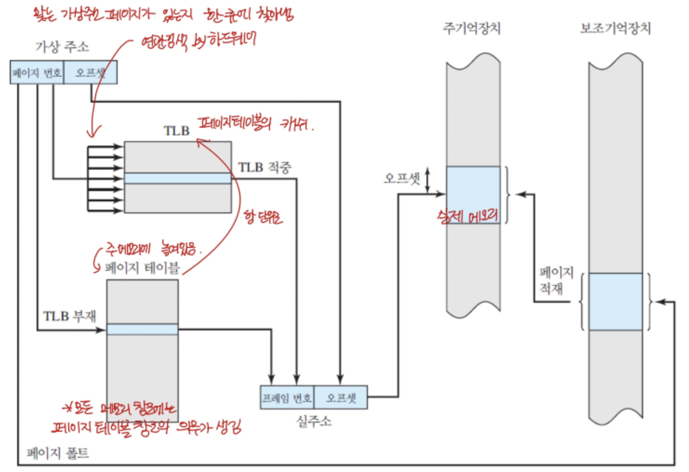

# 메모리 관리 장치 Memory Management Unit

- MMU: 프로그램 간 메모리 침범, 관찰 혹은 수정 등의 문제를 막기 위한 장치.
- 물리 주소: 실제 메모리의 주소
- 가상 주소: 물리 주소를 효율적으로 사용하기 위해서 한번 추상화한 주소.

- 페이지 테이블: 가상 주소(Logical address)를 물리 주소로 매핑하기 위한 테이블. 메모리에 올라가 있다.
- 예시: 16비트 주소의 가상 주소에서 하위 9비트\(0~9\)와 상위 7비트로 나누는 MMU가 있다고 가정하자.  
  ? 페이지의 크기는 얼마인가?  
  -> (상위 7비트는 테이블에 등록되어 있으므로) 페이지 하나의 크기 = 2^9 = 512 바이트  
  ? 페이지 테이블의 크기는?
  -> 페이지 테이블의 크기 = 2^7 = 128개

- 페이지 경계
- 공유 메모리

? 64비트 예제에서 왜 페이지 테이블이 4GiB이고, 페이지의 크기가 줄면 페이지 테이블의 크기가 늘어나는가

- 실행 불가 비트
- 페이지 폴트

# 가상 메모리

- 가상 메모리: 물리 메모리에 올라가지 못한 프로그램의 나머지 메모리 영역. 보조 기억장치에 올라가있다.
- 스왑 아웃: 메모리의 내용을 보조 기억장치로 빼 두는 것.
- 스왑 인: 보조 기억장치에서 찾아서 메모리로 올리는 것.
- 요구불 페이징 demand paging
- 최소 최근 사용 LRU

# 시스템 공간과 사용자 공간

- 시스템 모드: OS의 모든 자원에 접근 가능한 모드.
- 사용자 모드: 제한된 자원에만 접근 가능한 모드.
- 시스템 콜, 트랩 그리고 인터럽트: 사용자 모드의 프로그램이 커널 영역의 명령이 필요한 경우 시스템 콜을 요청한다. 이 때 커널 영역에서는 트랩을 통해 이를 알게 되는데, 이 요청을 수행하기 위해서 인터럽트를 걸어서 CPU를 뺏어온다. 이후 CPU의 모드를 커널모드로 바꿔서 작업하고, 작업이 끝나면 사용자 모드로 전환 후 결과물을 반환한다.

# 메모리 계층layering 과 성능

초기에는 cpu와 메모리의 처리속도가 비슷했으나, 점점 cpu 성능이 좋아지면서 노는 시간이 늘어났다. 이를 줄이기 위한 것들이 필요해졌다.

- 속도: 레지스터 > L1 캐시 > L2 > L3 > 주 메모리 >> 디스크
- 캐시: 메모리 I/O를 줄이기 위해 자주쓰는 데이터를 임시로 가지고 있기 위한 레지스터
- 디스패처: 캐시들에 적절하게 배분하는 유닛.
- 프리페치
  ? 프리페치는 언제, 어떻게 하는 것인가?
  ? 분기 예측
- 캐시 일관성: 병렬 컴퓨팅에서 각 코어가 동일한 데이터 A를 캐시에 담아두고 있을 때, 한 캐시의 A가 업데이트 되면 다른 캐시의 A도 일관성을 유지하기 위한 방법들.
  - 스누핑 구조: 버스를 계속 감시해서 캐시에 접근하는 것을 캐치해서 처리하는 방식
    - write through: 캐시 업데이트 시 메모리도 업데이트 한다.
    - write back: 캐시를 업데이트한 후 사용을 다 하고 나서 캐시에서 없어질 때 메모리를 업데이트 한다. -> 그래서 일관성이 깨지는 경우가 있다.
  - 디렉토리 구조: 캐시들 간 상호작용을 추적하고 관리하기 위한 구조.

# 코프로세서 coprocessor

- 코프로세서: cpu 옆에 있는 보조 프로세서로 cpu 대신 단순 반복적인 일을 수행한다.
- 직접 메모리 접근: 

# 메모리상의 데이터 배치

- 정적 데이터
- 동적 데이터
- 메모리 구조
- MMU가 있는 시스템/없는 시스템의 메모리 구조 차이

# 프로그램 실행

- 라이브러리
- 링크
- 실행과 링크가 가능한 형식 ELF
- 정적 링크
- 동적 링크
- 런타임 라이브러리
- 실행 순서

# 메모리 전력 소비

- 코드 작성시 주의 사항
  - 모바일:
  - 데이터 센터:
