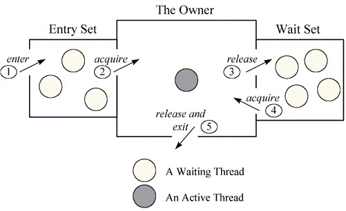

# Concurrency

# Critical-Section

# Peterson's Solution

- 

# Synchronization Hardware

# Mutex Locks

# Semaphore

# 동기화의 고전적인 문제들

## 1. Bounded-Buffer

생산자 - 소비자 문제.

## 2. Readers-Writers

- 생산자-소비자는 버퍼가 큐(푸쉬/팝)
- 독자-작가는 읽기/수정 관계
- 독자/작가 중 하나에게 우선순위를 부여. 보통은 독자에게 우선순위를 부여한다.
- 독자에게 우선순위를 부여해야 작가가 데이터가 깨지지 않는다.

### 3. Dinigns-Philosophers

# Monitors

프로세스가 상호배제하고 wait 할 수 있도록 해주는 자료구조

컨디션 x에 두 연산 제공

- x.signal() : x를 요청한 프로세스 중 하나를 깨움. 기다리는 프로세스가 없으면 아무일도 일어나지 않음.
- x.wait() : 프로세스를 wait시킴

# 동기화 문제

os 혹은 라이브러리별 문제들

# 대체 접근법

## **Deadlock Detection**

**on Single Category Resource**

- 여러 종류의 타입이 각각 하나의 인스턴스 자원이 있을 때 찾는 방법
- 리소스를 없애고, 프로세스간 연결했을 때 싸이클이 있으면 데드락

### **Deadlock Recovery**

- Process Termination : 관계되어 있는 모든 process를 죽이거나 deadlock이 풀릴 때 까지 process를 죽임.
    - deadlock이 풀릴 때 까지 죽이는 것은 죽이는 process를 어떻게 정할건지 생각해야 함.
- Resource Preemption : 자원이 선점 가능하게.
    - 어떤 process로부터 자원을 빼올것인가, starvation은 일어나지 않을까 고민해야 함.