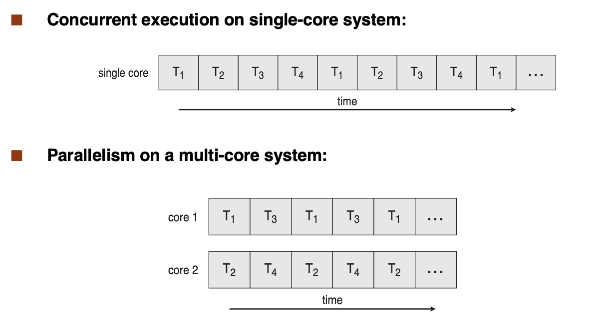
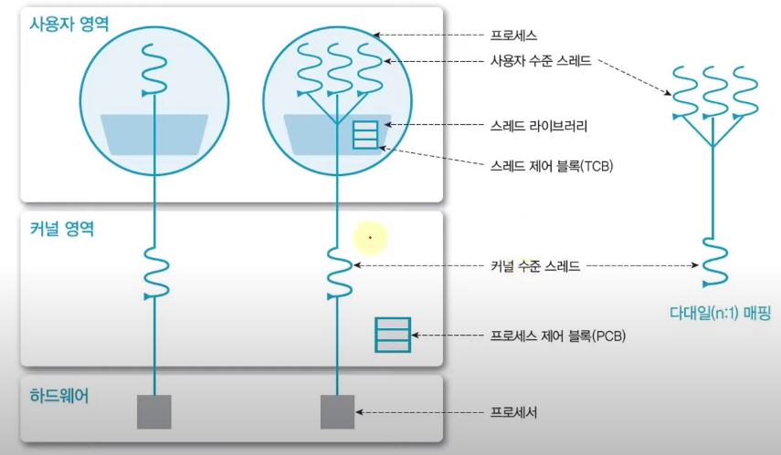
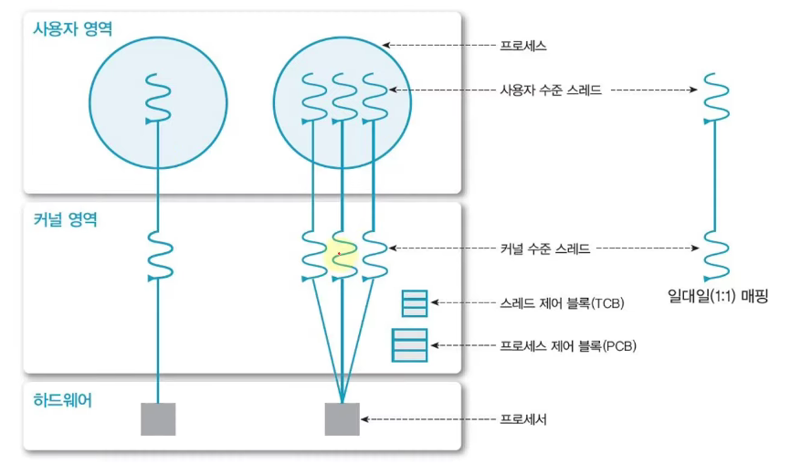
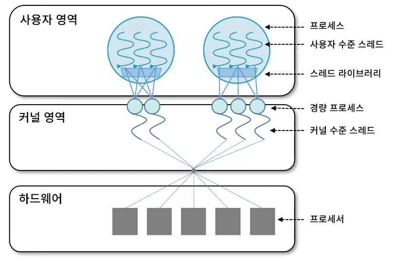

# Thread

# Thread

## Process와 Thread

- 쓰레드란 : '실'이란 단어로, 흐름을 말한다.
- Process = resource + thread
  - 스레드 = 제어정보 ( stack pointer, program counter, 상태 등 ) + 지역 변수 + stack
  - 자원 (메모리) = 코드 + 전역 변수 + 힙 + ...
- 프로세스는 여러 스레드로 이루어 진다.
- 자원은 여러 스레드가 공유한다.
- Light weight process (LWP)
  - 프로세스 = 자원 + 제어
  - 스레드 = 제어
- 프로세서 활용의 기본 단위
- 구성 요소
  - Thread id
  - Register set (PC, SP 등)
  - Stack (local Data)

### 장점

- 사용자 응답성 : 일부 처리가 지연되어도, 다른 스레드는 계속 처리 (ex. 게임 - 화면출력, 입력, 오디오 처리)
- 자원 공유 : 효율성 증가 ( 컨텍스트 스위칭이 발생하지 않아 커널의 개입을 피할 수 있기 때문 )
- 경제성 : 스레드의 생성과 컨텍스트 스위칭이 프로세스에 비해 효율적.
- 멀티 프로세서 활용

## 다중코어 프로그래밍

단일 컴퓨팅 칩에 다중 컴퓨팅 코어를 배치할 수 있게 되면서, 시스템이 개별 스레드에 각 코어를 배치하여 스레드들이 병렬적으로 실행됨.

### 다중 코어 프로그래밍 시 해결 과제

1. **태스크 인식**

   → 병렬처리를 위해 분리 할 수 있는 태스크 영역을 인식하는 작업 필요

2. **균형**

   → 전체적으로 균등하게 일 분배되도록

3. **데이터 분리**

   → 태스크가 접근/조작 하는 데이터 또한 개별 코어에서 사용할 수 있도록

4. **데이터 종속성**

   → 태스크간 종속성이 발생할 경우, 프로그래머가 이를 잘 동기화해야한다.

### 병렬 실행

- **데이터 병렬 실행**

  → 동일한 데이터를 파트를 나눠, 다수의 계산 코어에 분배하고 각 코어는 분배된 데이터로 동일한 연산을 수행한다.

  ex) 듀얼 코어 : n개의 데이터에서 1~n/2까지 데이터는 1번 코어, n/2+1~n까지 데이터는 2번 코어가 처리

- **태스크 병렬 실행**

  → 태스크를 파트를 나눠, 다수의 계산 코어에 분배하고 각 코어는 동일한 데이터로 분배된 태스크를 수행한다.

## 스레드 모델

### 사용자 수준

- 사용자 영역의 스레드 라이브러리로 구현 됨
  - 스레드의 생성, 스케줄링 등
  - **POSIX** thread(Pthread), **Win32** threads, **Java** thread 등
- 1:N 매핑
- 커널은 이 스레드의 존재를 모름
  - 장점
    1. 커널의 개입이 없음
    2. 이식성이 높음 (JVM 처럼 동일한 스레드 라이브러리가 설치된 환경이면 그대로 가져다 쓸 수 있음)
  - 단점 : 하나의 스레드가 봉쇄형 시스템 콜 할 경우, 모든 스레드가 대기(singled-threaded kernel의 경우)
    1. 여러 스레드 중 하나가 봉쇄형 시스템 콜
    2. 프로세스도 블럭 상태로 들어감
    3. 이에 따라 다른 스레들은 일을 할 수 있지만, 같이 대기 상태로 들어감.

## 커널 수준

- 커널이 직접 관리하는 스레드
- 1:1 매핑
- 커널 영역에서의 스레드 생성, 관리가 수행됨 → context switching 부하가 큼
- 하나의 스레드가 block 되어도, 다른 스레드는 작업 수행 가능

### 혼합형

- n:m 매핑 - n개 사용자 수준 스레드 : m개 커널 스레드(n ≥ m)
- 장점만 적절히 mix 한 버전

## 스레딩

### 비동기 스레딩(Asynchronous)

부모가 자식 스레딩을 생성한 후, 부모와 자식 스레드가 독립적으로 실행되는 방법.

독립적이기 때문에 데이터 공유는 거의 없다.

### 동기 스레딩(Synchronous)

부모가 자식 스레딩을 생성한 후, 자식 스레드 종료를 기다렸다가 자신도 실행.

상당한 데이터 공유를 수반한다.

*애초에 기다릴거면 왜 스레드 생성을 하지? 스레드 생성도 일인데... 모듈성 때문인가?*

## 암묵적 스레딩

스레드 생성과 책임을 프로그래머에서 컴파일러와 런타임 라이브러리에게 넘겨주는 기법. 개발자는 병렬 작업만 실행하면 되기에 멀티스레딩을 효율적으로 활용할 수 있다.

### 예시 - 웹 서버

웹 서버 : Request마다 새로운 스레드 생성

문제 1. 스레드 생성 마다 소요하는 시간

문제 2. 무한하지 않은 스레드 개수

→ 스레드 풀로 해결

### 스레드 풀

시작시 일정 수의 스레드를 미리 만들어두는 것. 쓰레드에게 태스크를 전달만 한다.

- 생성을 미리 해둬서 종종 더 빠르다.
- 스레드 개수에 제한을 두기 때문에, 많은 스레드를 처리할 수 없는 시스템에 이용 가능.
- 태스크 생성을 태스크에서 분리했기에, 태스크 실행 전략이 유연해진다. (예 - 일정 시간마다 태스크 실행)