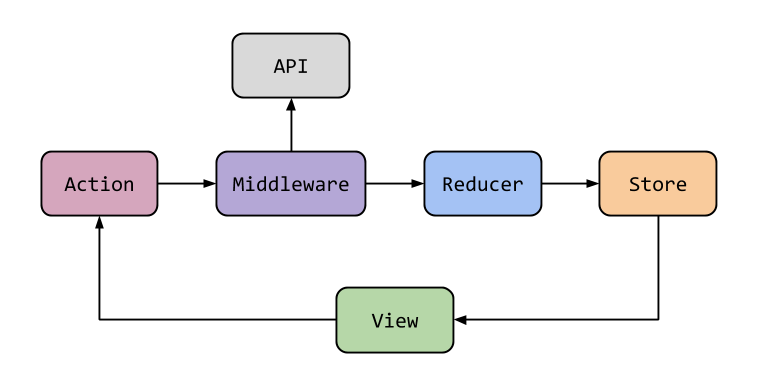

# 2. 리덕스의 주요 개념



그림 6-1 리덕스에서 상탯값이 변경되는 과정

> View == Component

### 6.2.1 액션

액션은 **type 속성값**을 지닌 자바스크립트 객체다.

```jsx
// bad
store.dispatch({type: 'ADD', title: '영화 보기', priority: 'high'}) // 1

// good
store.dispatch({type: 'todo/ADD', title: '영화 보기', priority: 'high'}) // 2
store.dispatch({type: 'todo/REMOVE', id: 123})
store.dispatch({type: 'todo/REMOVE_ALL'})
```

type 속성값은 고유해야 하기 때문에 2와 같이 접두사를 붙이는 방법이 많이 사용된다.

dispatch 메서드를 호출할 때 직접 액션 객체를 입력하는 방법은 지양하는게 좋다. 예제에서 'todo/ADD' 액션의 경우 title, priority 속성값이 항상 존재하도록 강제할 필요가 있다.

```jsx
export const ADD = 'todo/ADD'                   // 1
export const REMOVE = 'todo/REMOVE'
export const REMOVE_ALL = 'todo/REMOVE_ALL'

export function addTodo({title, priority}){
	return { type: ADD, title, priority})  // 2
}
export function removeTodo({id}){
	return { type: REMOVE, id})  // 2
}
export function removeAllTodo(){
	return { type: REMOVE_ALL})  // 2
}

store.dispatch(addTodo({title: '영화 보기', priority: 'high'}))  // 3
store.dispatch(removeTodo({id: 123}))                         // 3
store.dispatch(removeAllTodo())                               // 3
```

type 이름을 상수 변수로 만들고, 리듀서에서도 사용하기 위해 export한다(1). 세 개의 액션 생성자 함수를 정의하고 마찬가지로 리듀서에서 사용하기 위해 export(2). 그 후 dispatch 메서드에 액션 생성자 함수를 이용한다(3).

### 6.2.2 미들웨어

미들웨어는 리듀서가 액션을 처리하기 전에 실행되는 함수. 로그 출력, 예외 처리 등으로 활용 가능.

```jsx
const middleware = store => next => action => next(action)

///////

const middleware = function(store){
	return function(next){
		return funcion(action){
			return next(action)
		}
	}
}
```

미들웨어는 함수 세개가 중첩된 구조이다. next 함수를 호출하면 다른 미들웨어 함수가 호출되면서 최종적으로 리듀서 함수가 호출된다. 코드 6-1은 아무런 작업이 next를 호출하기에 무의미한 미들웨어 함수다.

```jsx
import { createStore, applyMiddleware } from 'redux'
const middleware1 = store => next => action => { // 1
	console.log('m1 start')
	const result = next(action)
	console.log('m1 end')
	return result
}
const middleware2 = store => next => action => {
	console.log('m2 start')
	const result = next(action)
	console.log('m2 end')
	return result
}
const reducer = (state, action) => { // 2
	console.log('reducer')
	return state
}
const store = createStore(reducer, applyMiddleware(middleware1, middleware2)) // 3
store.dispatch({type: 'someAction'})  // 4

// middleware1 start
// middleware2 start
// reducer
// middleware2 end
// middleware1 end
```

(1)간단한 두개의 미들웨어를 정의했다. (2)아무 일도 하지 않는 리듀서. (3)applyMiddleware 함수를 이용해서 미들웨어가 입력된 스토어 생성. (4)액션을 dispatch하면 로그가 출력된다.

1. middleware1의 next 함수는 middleware2 함수 실행. 
2. middleware2의 next 함수는 스토어가 갖고 있던 dispatch 메서드 호출
3. 최종적으로 스토어의 dispatch 메서드는 리듀서 호출

---

- 리덕스의 applyMiddleware 함수

    ```jsx
    const applyMiddleware = (...middlewares) => createStore => (...args) => {
    	const store = createStore(...args)   // 1
    	const funcsWithStore = middlewares.map(middleware => middleware(store))  // 2
    	const chainedFunc = funcsWithStore.reduce((a,b) => next => a(b(next))) // 3
    	return {...store, 
    		dispatch: chainedFunc(store.dispatch) // 4
    	}
    }
    ```

    1. createStore함수를 호출해서 스토어 생성
    2. 생성된 스토어와 함께 모든 미들웨어의 첫 번째 함수 호출
    3. 모든 미들웨어의 두 번째 함수를 체인으로 연결. 만약 미들웨어가 세 개였다면 next ⇒ a(b(c(next)))
    4. 외부에 노출되는 스토어의 dispatch 메서드는 미들웨어가 적용된 버전으로 변경된다.(즉 a(b(next)) )

    ```jsx
    function dispatch(action) {
    	currentState = currentReducer(currentState, action)   // 1
    	for(let i = 0; i< listeners.length; i++){  
    		listeners[i]()   // 2
    	}
    	return action
    }
    ```

    1. 리듀서 함수를 호출해서 상탯값 변경
    2. dispatch 메서드가 호출될 때 마다 등록된 모든 이벤트 처리 함수 호출. 상태값이 변하지 않아도 이벤트 처리 함수를 호출한다. 

---

**미들웨어의 활용**

- setTimeout 사용으로 실행 딜레이 추가

### 6.2.3 리듀서

리듀서는 액션이 발생했을 때 새로운 상탯값을 만드는 함수.

```jsx
(state, action) => nextState
```

```jsx
function reducer(state = INITIAL_STATE, action) {    // 1
	switch(action.type){
		case REMOVE_ALL:    // 2
		return {            // 3
			...state, 
			todos: []
		}
		case REMOVE_ALL:
		return {
			...state, 
			todos: state.todos.filter(todo => todo.id !== action.id)
		}
		default:
			return state // 4
	}
}

const INITIAL_STATE = { todos: [] }
```

1. 초기 상탯값을 정의
2. 액션 타입별 case
3. 상탯값은 불변 객체로 관리해야하므로 수정 할 때 마다 새로운 객체 생성
4. 처리할 액션 없으면 상태값 유지

```jsx
function reducer(state = INITIAL_STATE, action) {   
	switch(action.type){
		case REMOVE_ALL:
		return { 
			...state,  // 1
			todos: [
				...state.todos,
				{ id: getNewId(), title: action.title, ... }    // 2
			]
		}
		// ...
	}
}
```

1. 2. 할 일 목록을 추가하기 전개 연산자를 두 번 사용했다. 이는 가독성을 많이 떨어뜨린다. 불변 객체를 관리할 목적으로 나온 패키지 중 이머(immer) 패키지를 사용하면 다음과 같다. 

```jsx
import produce from 'immer'

const person = {name: 'mike', age: 22}
const newPerson = produce(person, draft => {
	draft.age = 32
})
```

```jsx
function reducer(state = INITIAL_STATE, action) {   
	return produce(state, draft => {     // 1
		switch(action.type){
			case REMOVE_ALL:
				draft.todo.push({ id: getNewId(), title: action.title, ... })  // 2
				break
			// ...
		}
	})
}
```

1. produce로 switch를 감싸고, 새로 생성된 객체를 반환한다.
2. push로 넣지만, 전체 객체(state)가 새로 생성되므로 따로 처리할 필요가 없다.

### 주의할 점

1. 데이터 참조

    리덕스의 상탯값은 불변 객체이므로 언제든 객체의 참조값이 변경될 수 있다. 따라서 객체를 참조할 땐 참조값이 아니라 고유 ID값을 이용하는게 좋다.

    ```jsx
    // bad
    function reducer(state = INITIAL_STATE, action){
    	return produce(state, draft => {     
    		switch(action.type){
    			case SET_SELECTED_PEOPLE:
    				draft.selectedPeople = draft.peopleList.find(  // 1
    					item => item.id === action.id
    				)
    				break
    			case EDIT_PEOPLE_NAME:         // 2
    				const people = draft.peopleList.find(item => item.id === action.id)
    				people.name = action.name
    				break
    			// ...
    		}
    	})
    }

    // good
    function reducer(state = INITIAL_STATE, action){
    	return produce(state, draft => {     
    		switch(action.type){
    			case SET_SELECTED_PEOPLE:
    				draft.selectedPeople = action.id     // 3
    				break
    			// ...
    		}
    	})
    }
    ```

    1. selectedPeople 변수는 현재 선택된 사람을 참조한다.
    2. EDIT_PEOPLE_NAME 케이스가 실행 되면 새로운 state가 생성되는데, 이때 selectedPeople 객체 또한 새로 생성된다. 때문에 selectedPeople 변수는 더이상 그 사람을 참조하지 못한다.
    3. id 값을 참조한다면 selectedPeople가 변경되어도 문제가 없다.
2. 순수 함수

    리듀서는 순수함수여야 한다.

    ```jsx
    // bad
    function reducer(state = INITIAL_STATE, action){
    	return produce(state, draft => {     
    		switch(action.type){
    			case SAY_HELLO:
    				const random = Math.floor(math.random() * 10 + 1)  // 1
    				draft.msg = `hello, ${random}th person`
    				break
    			case INCREMENT:
    				callApi({url: '/sendApi', data:action})         // 2
    				draft.value += 1
    				break
    			// ...
    		}
    	})
    }
    ```

    1. 랜덤함수를 사용하면 매번 다른 값이 나오므로 순수함수가 아니다.
    2. API호출은 부수효과(side effect)기 때문에 순수함수가 아니다. API 호출은 액션 생성자 혹은 미들웨어에서 한다.

### createReducer 함수로 리듀서 작성

```jsx
const reducer = createReducer(INITIAL_STATE, {   // 1
	[ADD]: (state, action) => state.todos.push(action.todo),
	[REMOVE_ALL]: (state) => (state.todos = []),
	[REMOVE]: (state, action) => (
		state.todos = state.todos.filter(todo => todo.id !== action.id)
	),
})
function createReducer(initialState, handlerMap){
	return function(state = initialState, action) {     // 2
		return produce(state, draft => {     // 3
			const handler = handlerMap[action.type]     // 4
			if(handler){
				handler(draft, action)
			}
		})
	}
}
```

1. createReducer 함수 호출
2. 리듀서 함수 반환
3. immer로 newState 생성
4. 등록된 액션이 있으면 실행

### 6.2.4 스토어

스토어는 리덕스의 상탯값을 가지는 객체. 액션의 발생은 스토어의 dispatch 메서드로 시작된다. 

액션 발생시 : 미들웨어 함수 실행 > 리듀서 실행 > 새로운 상탯값으로 변경 > 사전에 등록된 이벤트 처리 함수에 액션 처리 끝남 알림.

리덕스는 전체 상탯값을 하나의 스토어에 저장한다. 기술적으로는 여러 스토어를 만들어 사용해도 되지만, 단순히 데이터 종류를 구분하기 위함이라면 combineReducer 함수(추후 설명)를 사용하면 된다.

```jsx
const INITIAL_STATE = {value: 0}
const reducer = createReducer(INITIAL_STATE, {
	INCREMENT: state => (state.value += 1 )
})
const store = createStore(reducer)

let prevState
store.subscribe(()=> {           // 1
	const state = store.getState()
	console.log(state === prevState) ? 'state same' : 'state diff') // 2
	prevState = state
})

store.dispatch({ type: 'INCREMENT' })    // 3
store.dispatch({ type: 'OTHER_ACTION' }) // 4
store.dispatch({ type: 'INCREMENT' })    // 5
```

1. subscribe 메서드로 이벤트 처리 함수 등록. 액션이 처리될 때 마다 호출
2. 상탯값 변경 확인
3. 'INCREMENT' 액션 발생 시 상탯값 변경 출력
4. 미 등록 액션 발생 시 상탯값 같음 출력
