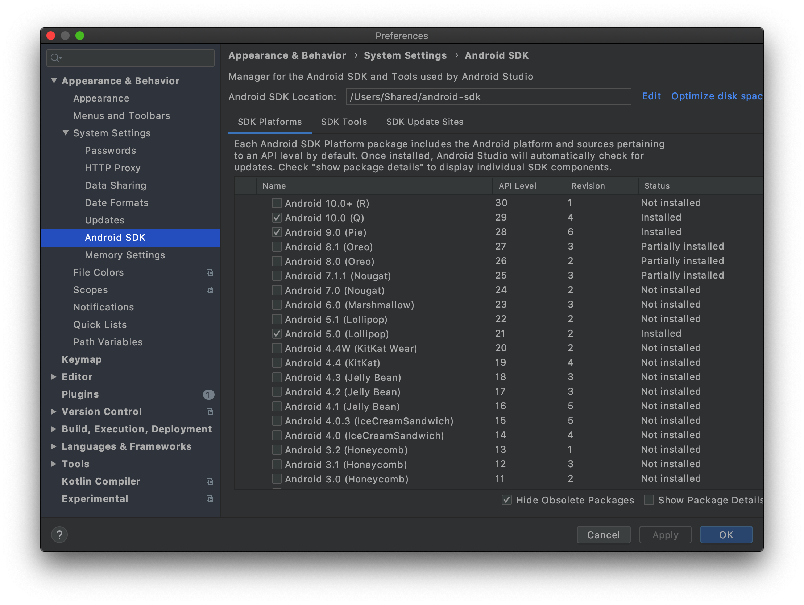
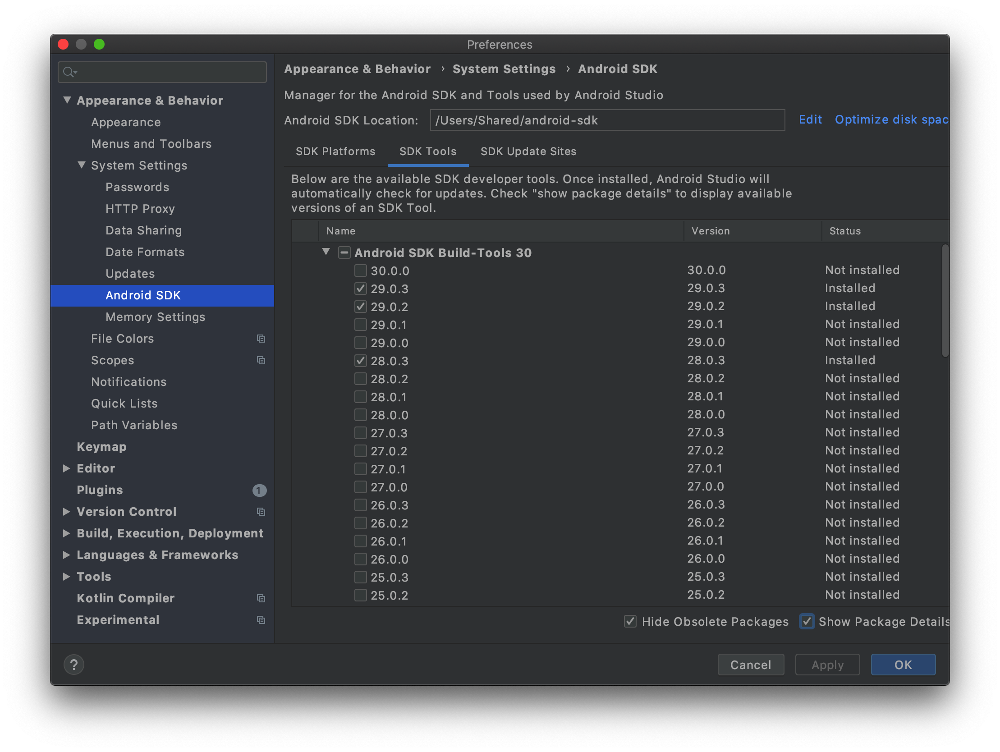

# Build.VERSION_CODES 오류

Created: 2020년 6월 5일 오전 10:15
Tags: Android

## 에러

(대략) Build.VERSION_CODES.Q is undefined

## 상황

react-native-webview 의 업데이트로 react-native-webview 가 Android Q(sdk version 29)를 필요로 했음.

```java
public boolean grantFileDownloaderPermissions() {
    // Permission not required for Android Q and above
    if (Build.VERSION.SDK_INT >= Build.VERSION_CODES.Q) {
      return true;
    }

    boolean result = ContextCompat.checkSelfPermission(getCurrentActivity(), Manifest.permission.WRITE_EXTERNAL_STORAGE) == PackageManager.PERMISSION_GRANTED;
    if (!result && Build.VERSION.SDK_INT >= Build.VERSION_CODES.M) {
      PermissionAwareActivity activity = getPermissionAwareActivity();
      activity.requestPermissions(new String[]{Manifest.permission.WRITE_EXTERNAL_STORAGE}, FILE_DOWNLOAD_PERMISSION_REQUEST, webviewFileDownloaderPermissionListener);
    }

    return result;
  }
```

## 대처

안드로이드 sdk 버전 업 및 설정

## 방법

1. 안드로이드 sdk Q(29) 설치

    

2. 29.0.x 버전 설치

    

3. build.gradle에서 sdk 버전 세팅
    - buildToolsVersion : 2. 에서 설치한 build-tools 의 버전
    - minSdkVersion : 지원할 최소의 안드로이드 버전
    - compileSdkVersion : 업데이트 할 버전
    - targetSdkVersion : 업데이트 할 버전
    - supportLibVersion : 사용하는 라이브러리들을 지원할 버전

    .png)
